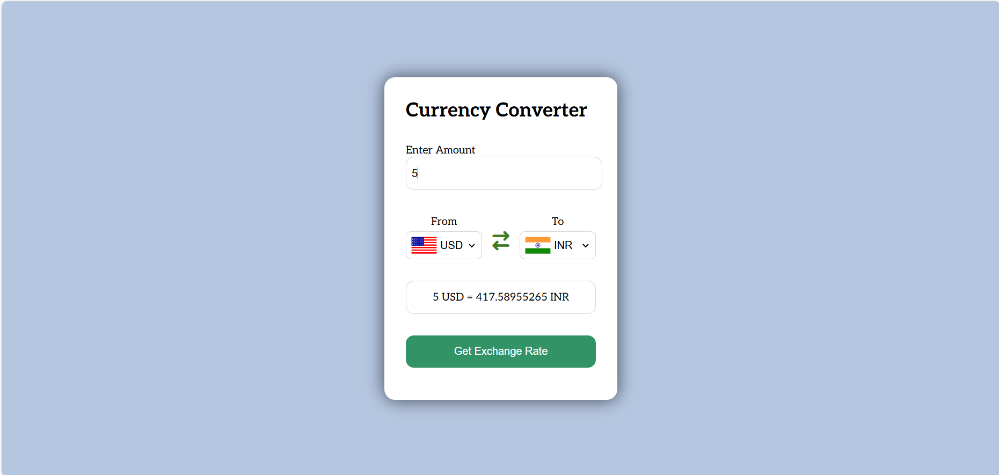

# Currency Converter
## Dive into the project
<em>(Tap on currency icon to view the project)</em>

## Overview:
A user-friendly web application developed with HTML, CSS, and JavaScript that allows you to convert currencies with ease. Select the currencies and amount, and get the latest exchange rates to see the conversion result instantly. This app provides an intuitive interface for seamless user experience, making currency conversion quick and efficient.

## Features:
- **Real-time Exchange Rates:** Get the latest exchange rates for accurate currency conversion.
- **Easy Selection:** Choose currencies from dropdowns with country flags for easy identification.
- **Automatic Flag Updates:** Flags update automatically based on selected currencies.
- **Responsive Design:** Ensures compatibility across various devices and screen sizes.
- **Default Values:** Default selection for "From" currency is USD and for "To" currency is INR.

## Technologies Used:
- **HTML:** Used for structuring the currency converter interface and elements.
- **CSS:** Used for styling the visual presentation of the interface and layout.
- **JavaScript:** Used for implementing the interactive functionality, fetching exchange rates, and updating the interface dynamically.
  <pre>
  </pre>

## Usage:
1. **Enter Amount:**
   - Input the amount you wish to convert.
2. **Select Currencies:**
   - Choose the currency you are converting from and the currency you are converting to from the dropdown menus.
3. **Get Exchange Rate:**
   - Click the "Get Exchange Rate" button to see the conversion result.
4. **Automatic Updates:**
   - The application will fetch the latest exchange rates and display the conversion amount.

## Learnings:
Through the Currency Converter project, I gained valuable insights into various aspects of web development:

- **API Integration:** Explored the integration of external APIs to fetch real-time currency exchange rates, understanding how to leverage third-party data sources for dynamic content.
- **Asynchronous Programming:** Enhanced proficiency in handling asynchronous operations using promises, async/await syntax, ensuring smooth and efficient data retrieval and display.
- **JSON Data Handling:** Developed skills in working with JSON files for storing and managing structured currency data, facilitating efficient data manipulation and retrieval within the application.
- **Responsive Design:** Improved techniques for creating responsive web designs that ensure seamless user experiences across different devices and screen sizes.
- **HTML Structure:** Designing the currency converter interface using HTML taught me about structuring elements and creating interactive components.
- **CSS Styling:** Applying CSS styles to the layout and elements allowed me to enhance the visual presentation and user experience.
- **JavaScript Event Handling:** Implementing dropdown interactions and fetching data in JavaScript helped me understand event handling and asynchronous operations.

## Contribution:
Contributions to the project are welcome! Feel free to fork the repository, make improvements, and submit pull requests to suggest new features or enhancements.

## License:
This project is open-source under the [MIT License](LICENSE), allowing for collaboration and distribution.
